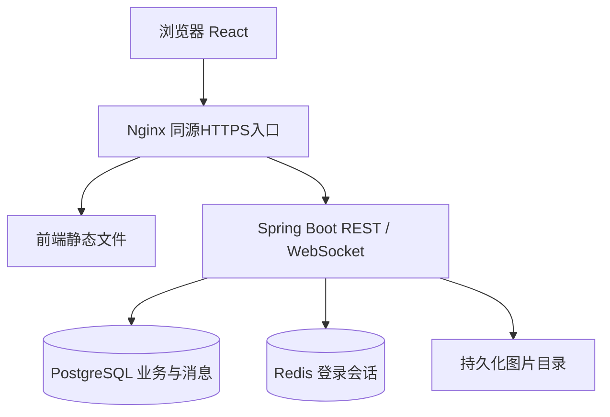

# Campus Neighbour 技术选型与系统架构

版本：v0.1 完整初稿｜日期：2026年9月18日｜负责人、审核人：待填写。

状态：供团队评审，尚未实现或验证。下文具体规则为建议基线；涉及需求说明书D01—D13的决定仍待确认。

## 1 阅读目的与决策状态

本文供前后端及部署成员使用，解释组件职责和连接方式。技术名称来自用户已提出的方案；具体补丁版本和组合兼容性尚未验证。[技术评审](technology-review.md)保留选型背景及官方参考入口，本文是工程设计入口。

前端方向已确定：React、TypeScript、Tailwind、pnpm，中英双语及深浅主题。后端按Java/Spring Boot方案准备。版本锁定、组件库、部署资源仍待D13确认。初稿不宣称任何版本已经通过集成测试。

## 2 系统结构



一个React应用同时包含学生页面及管理员页面，一个Spring Boot模块化单体后端。单机单实例为初期部署假设；增加实例前需要重新设计WebSocket跨实例分发和共享图片存储。管理员权限由后端校验。

采用同仓管理前后端（Monorepo），便于需求、接口和实现一起审查。pnpm只管理JS/TS工程，Java仍用Maven Wrapper；无需把每项功能拆成独立应用。以下仅是未来目录约定，尚未创建：

```text
apps/web/          前端
apps/api/          后端
infra/             Compose、Nginx与部署配置
docs/              工程文档
.github/workflows/ 自动检查
```

## 3 选型与版本清单

| 层 | 方案 | 用途／锁定状态 |
| --- | --- | --- |
| 前端 | React 19、TypeScript、Vite 8、Tailwind CSS 3 | UI与构建；具体版本待安装验证，不能混用Tailwind 4配置 |
| 数据和路由 | TanStack Router、TanStack Query | URL与服务端缓存分离；具体版本待定 |
| 本地状态 | Zustand | 仅跨页面本地状态；不复制Query中的商品数据 |
| 语言主题 | i18next/react-i18next建议方案、CSS主题变量 | 用户内容不自动翻译；保存偏好 |
| 前端工具 | pnpm；Node 24 LTS候选 | 最终运行时与锁文件待组合验证 |
| 后端 | Java 21 LTS Temurin、Spring Boot 4.1.x + MVC | 以用户方案为基线，补丁版本待验证 |
| 数据 | PostgreSQL 18.x、MyBatis-Plus 3.5.x Boot 4专用starter | 复杂查询自写SQL；使用支持Boot 4的具体发行版本 |
| 登录 | Spring Security、Spring Session、Redis | HttpOnly Cookie会话；账号权限在后端执行 |
| 消息 | Spring WebSocket + STOMP | 服务端推送；数据库历史为事实来源 |
| 校验与迁移 | Jakarta Validation、Flyway及PostgreSQL模块 | 校验输入与版本化数据库变更 |
| 接口说明 | springdoc-openapi 3.x | 实施后生成并比对接口说明 |
| 运行 | SLF4J/Logback、Actuator、Scheduling | 日志健康检查；定时任务按实际需要 |
| 后端构建测试 | Maven Wrapper、Spring Boot Test、JUnit、Testcontainers | 数据一致性测试使用真实PostgreSQL容器 |
| 部署与检查 | Docker Compose、Nginx、GitHub Actions | 固定镜像版本，配置与密钥分离 |

前端测试工具建议Vitest、Testing Library、Playwright；为候选方案，工程初始化时验证并固定版本。所有补丁版本、镜像摘要和操作系统组合记录于实施后的版本清单，不写latest作为可复现配置。

## 4 模块边界

| 模块 | 负责 | 不负责 |
| --- | --- | --- |
| identity | 注册、登录、会话、角色、个人资料 | 不假设学校SSO存在 |
| catalog | 商品、图片、校园字典、搜索、季节专区 | 不执行交易完成 |
| messaging | 会话、持久化消息、模板、未读位置、重连 | 不自动回答、不修改价格 |
| trading | 预约、商品占用、快照、取消、换物、确认 | 不接支付和物流 |
| reputation | 完成交易后评价、查询 | 不自动计算惩罚性信用分 |
| moderation | 管理限制、隐藏、审计 | 不冒充用户收货 |
| notifications | 持久化通知、已读、事件推送 | 不依赖短信邮件 |

交易服务调用目录模块提供的商品锁定／占用操作，所有业务更新在同一数据库事务内。Controller负责解析请求，应用服务负责权限和事务，持久层负责SQL；不要在前端实现最终状态合法性判断。

## 5 关键链路

### 登录与权限

同源HTTPS入口减少跨域配置。会话Cookie生产使用Secure、HttpOnly及适当SameSite；写操作要求CSRF token。退出失效会话并关闭相关连接。会话身份来自服务端，不能相信客户端传入senderId。账号限制需在每次写操作检查，不能只依赖登录时角色。

### 图片

上传校验大小、实际文件内容和类型；服务端生成存储键，防路径穿越。PostgreSQL存元数据与归属，文件落在持久化数据卷。先上传临时归属图片，再由发布请求关联；未关联图片按待定保留期清理。存储接口封装以方便以后替换对象存储。

### 交易一致性

PostgreSQL事务内按商品ID固定顺序加锁，验证AVAILABLE及可见性、所有者和内容版本，然后建交易、快照和占用记录。以唯一占用约束作为最后防线；Redis不作为商品唯一占用的权威来源。取消／完成同步更新交易、商品、占用、通知及业务事件。

### 实时聊天

初稿选择REST提交消息、STOMP接收推送，两者共同构成实时聊天。这样HTTP返回已持久化结果便于失败重试；无需再增加一套STOMP写入接口。消息入库后通过事务内outbox事件表记录待推送事件。提交后推送失败可重试，客户端按messageId去重。对话历史始终可通过REST补取。

每个用户仅订阅自己的`/user/queue/events`；握手、CONNECT和订阅都验证身份及来源。禁止客户端向任意用户地址发送或订阅别人的会话；业务成员校验仍在REST读写执行。断线时提示，重连补取历史与通知；“已发送”只代表服务器持久化，不代表对方已读。

### 主题和双语

Query管理商品等服务端数据，Router管理筛选URL，组件管理局部输入，Zustand只用于确有必要的全局偏好。后端返回稳定错误码，前端映射文案。模板发送时按locale取文本并存快照；历史不随界面语言切换改变。

## 6 安全、故障与观测

资源授权覆盖商品、会话、交易、通知和管理接口。公开简介仅返回白名单字段。密码单向哈希，密钥不进仓库，文本不作为HTML执行。限流阈值在测试后确定；日志不写密码、会话令牌和聊天全文。

数据库不可用时写入失败，不假报成功；Redis不可用时提示登录服务暂不可用，不能降级成绕过权限；推送失败时保留历史与待发事件，恢复后补发。图片缺失显示占位并记录异常。请求携带requestId以关联日志；健康检查区分应用存活与依赖就绪，详细诊断接口仅管理员可访问。

## 7 开发前验证清单

1. 锁定依赖后可干净构建；Boot、MyBatis-Plus、Flyway、springdoc与数据库实际兼容。
2. 数据库建表迁移和一次读写通过；并发占用只能成功一次。
3. Cookie、CSRF、Redis会话、退出及账号限制有效。
4. 两账号实时收发与断线补取；第三人读写／订阅被拒。
5. 双语和主题覆盖表单与错误状态；20字符计数跨前后端一致。
6. 数据库及图片卷重启保留；备份恢复演练可复现。

验证执行人、版本、日期、结果与证据：待填写。验证前不将本表解释为测试通过。

## 8 TDD对架构的要求

开发方式已确定为TDD，按[协作规范](../CONTRIBUTING.md)先失败测试、再必要实现、最后重构。纯业务规则可独立测试；时间、图片存储与事件推送通过明确边界替换测试依赖。交易、权限和会话仍须用真实数据库／会话组件做集成验证，不能只用Mock证明正确。前端先按页面可观察行为写组件测试，关键跨账号流程用浏览器测试覆盖。

接口和数据设计是初稿，测试暴露缺口时允许调整设计并同步文档；不为了遵守初稿结构而保留错误实现。
