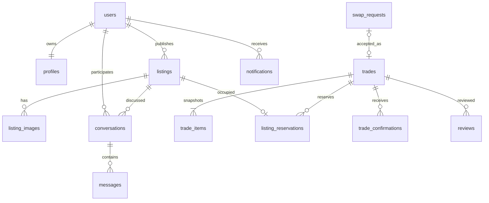

# Campus Neighbour 数据库设计

> **2026-09-19 实施更新：** 已加入实际Flyway迁移；部分简介字段采用JSONB、校园字典合表。实际表结构以`apps/api/src/main/resources/db/migration/V1__campus.sql`为准，对照说明见[实施记录](implementation/README.md)。

版本：v0.1 完整初稿｜日期：2026年9月18日｜负责人、审核人：待填写。

状态：供团队评审，尚未实现或验证。下文具体规则为建议基线；涉及需求说明书D01—D13的决定仍待确认。

## 1 约定

本设计对应[页面](product-design.md)与[接口](api/README.md)。数据库使用PostgreSQL方案，尚未建立SQL迁移。所有表主键为UUID；时间为timestamptz，存储时间点并按Asia/Shanghai展示；金额用整数分`price_minor bigint`、币种CNY，不使用浮点数。对外ID为字符串，金额JSON为整数。

通用字段：`id`主键、`created_at`非空、可变对象`updated_at`非空。以下标“?”为可空；未标者必填。长度和阈值是D03等待评审默认值。所有外键有数据库约束；历史交易禁止级联删除。公开接口按字段白名单输出，不直接序列化整行。

## 2 实体关系

用户在会话和交易中通过明确的双方字段关联；图只展示主要关系，以下字典为完整设计依据。

## 3 数据字典

| 表 | 核心字段（除通用字段） | 约束与用途 |
| --- | --- | --- |
| users | email varchar(254)、password_hash text、role STUDENT/ADMIN、status ACTIVE/RESTRICTED、verified_at? | lower(email)唯一；注册不能指定ADMIN；验证时间为空表示未验证 |
| profiles | user_id、nickname varchar(40)、college? varchar(100)、major? varchar(100)、year? varchar(20)、bio? varchar(500) | user_id唯一；公开简介不含邮箱与学号 |
| profile_courses | user_id、course_id、teacher? varchar(100)、description? varchar(500) | 同用户同课程唯一；用户自述，非官方信息 |
| buildings | name_zh varchar(100)、name_en? varchar(100)、active bool | 非激活项不能新选，历史保留 |
| courses | name_zh varchar(100)、name_en? varchar(100)、active bool | 初始模拟字典；正式名称待确认 |
| categories | code varchar(40)、name_zh/name_en varchar(100)、active bool | code唯一；是否为教材分类在种子数据确定 |
| listings | owner_id、title varchar(80)、description varchar(2000)、price_minor bigint、currency char(3)、category_id、building_id、condition_code、course_id?、book_author? varchar(100)、book_edition? varchar(100)、swap_enabled bool、wanted_description? varchar(500)、status、moderation_status、content_version int | price_minor≥0；币种CNY；成色NEW/LIKE_NEW/GOOD/FAIR；状态见第4节；owner不可修改 |
| images | owner_id、storage_key text、mime_type varchar(50)、size_bytes bigint、width int、height int | storage_key唯一；只接受审核通过的图像；不保存客户端原始路径 |
| listing_images | listing_id、image_id、position int | image_id唯一归属一个商品；(listing_id,position)唯一；位置0开始 |
| conversations | listing_id、buyer_id、seller_id、last_message_sequence bigint | 三元组唯一；双方不同；seller应为商品所有人；不因商品下架删除 |
| messages | conversation_id、sequence bigint、sender_id、client_message_id UUID、kind TEXT/TEMPLATE、body text、template_code?、locale? | (conversation_id,sequence)及(sender_id,client_message_id)分别唯一；用户必须为参与者；模板与正文由服务端确定 |
| conversation_reads | conversation_id、user_id、last_read_message_id? | (conversation_id,user_id)唯一；消息须属于此会话；读游标只能前进 |
| trades | kind SALE/SWAP、initiator_id、counterparty_id、status、meeting_location varchar(200)、meeting_at、cancel_reason? varchar(300)、completed_at?、cancelled_at? | 双方不同；SALE发起者=卖家，对方=买家；SWAP发起者=换物提出方 |
| trade_items | trade_id、listing_id、giver_id、receiver_id、snapshot jsonb | (trade_id,listing_id)唯一；SALE一行，SWAP两行；快照含标题价格币种成色课程版本及图片键 |
| listing_reservations | listing_id、trade_id | listing_id唯一；代表当前有效占用；完成／取消时删除占用行，历史保留trade_items |
| trade_confirmations | trade_id、user_id | 二元组唯一；只有接收者可确认；SALE一人，SWAP两人 |
| swap_requests | proposer_id、recipient_id、offered_listing_id、requested_listing_id、offered_version、requested_version、status、trade_id?、meeting_location、meeting_at | 商品不同、所有者分别匹配双方；trade_id唯一；接受时检查版本与状态 |
| reviews | trade_id、author_id、recipient_id、rating smallint、comment? varchar(300) | (trade_id,author_id)唯一；rating1—5；作者与对象是双方且不同；交易已完成 |
| notifications | user_id、type、resource_type、resource_id、read_at?、event_id | (user_id,event_id)唯一；不嵌入私聊全文 |
| seasonal_zones | title_zh/title_en varchar(100)、description_zh/description_en? text、starts_at、ends_at、enabled bool、category_id?、building_id? | ends_at>starts_at；仅筛选AVAILABLE且VISIBLE的商品 |
| moderation_logs | actor_id、target_type、target_id、action、reason varchar(300)、before_state jsonb、after_state jsonb | 追加保存；管理员操作必有理由 |
| outbox_events | event_type、aggregate_id、payload jsonb、status PENDING/SENT、attempts int、next_attempt_at?、sent_at? | 与业务记录同事务；发送后标记；有限重试及告警方案待实现 |
| idempotency_records | actor_id、operation、request_key UUID、request_hash、resource_id、response_status | (actor_id,operation,request_key)唯一；同键不同内容冲突；敏感完整响应不长期缓存 |

Redis仅保存登录会话与按需缓存，无需在PostgreSQL复制一套会话表。模板内容放服务端受版本管理的语言资源；消息保存实际发送文字，不依赖未来模板版本还原历史。

## 4 状态和一致性

商品status：AVAILABLE/RESERVED/SOLD/EXCHANGED/WITHDRAWN；moderation_status：VISIBLE/HIDDEN。交易status：WAITING_MEETUP/PARTIALLY_CONFIRMED/COMPLETED/CANCELLED；换物请求status：PENDING/ACCEPTED/REJECTED/WITHDRAWN/INVALIDATED。

跨表条件如“只有参与者能评价”不能仅靠CHECK完成；服务层在事务内校验，并通过唯一键、外键和行锁共同保护。枚举合法值、非负金额、评分范围可用CHECK。状态变更均写条件，不能无条件覆盖。

### 普通预约

1. 锁商品行，检查所有权、可见性、AVAILABLE和账号状态。
2. 写交易、商品快照和唯一占用；商品设RESERVED。
3. 同事务写通知、outbox和幂等记录，提交后返回交易。
4. 任一步失败全部回滚；冲突返回409。

### 换物接受

锁请求，按UUID统一顺序锁两件商品，再检查双方、版本、可见性和可用状态。写一个SWAP交易、两行快照、两个唯一占用，请求设ACCEPTED。并发抢同一商品最多一笔成功。其他未接受请求在读取或尝试接受时判为不可接受，并更新INVALIDATED；它们不占用物品。

### 完成与取消

普通买家确认，或换物第二人确认时，更新交易、商品和占用并生成通知。换物首人确认只更新确认记录与PARTIALLY_CONFIRMED。未有确认时任一参与者可取消；如商品仍符合公开条件恢复AVAILABLE，否则WITHDRAWN。单方确认后的强制关闭不提供接口，待D09决定。

管理隐藏商品不删除占用；受限账号建议允许只读历史、取消未交付交易及确认真实收货，不允许新发布、发消息、新预约、换物接受或评价，具体待D07确认。恢复账号不会自动恢复被隐藏商品。

## 5 索引与查询

- 商品：`(status,moderation_status,created_at,id)`以及category_id/building_id/course_id；根据实际组合查询EXPLAIN结果决定复合索引，避免每个组合都建。
- 基础关键词用标题／描述的参数化ILIKE，转义通配符；初期不承诺中文语义搜索。
- 消息：`(conversation_id,sequence)`用于稳定游标；插入消息事务锁会话行分配递增序号，防止延迟提交导致历史补取遗漏；双方会话分别索引buyer_id/seller_id与更新时间。
- 交易：分别索引initiator_id/counterparty_id与created_at；通知按`(user_id,created_at,id)`；outbox按`(status,next_attempt_at)`。
- 其他外键按删除校验和查询需求加索引；邮箱、占用、评价、消息去重等唯一索引不可省略。

## 6 迁移、演示与保留

迁移计划：V1账号／字典／商品；V2聊天；V3交易／换物／评价；V4通知／专区／审计及outbox。实际SQL尚未编写；迁移上线后只追加修正，不改已执行文件。

演示数据使用example.test邮箱、虚构楼栋课程、独立管理员和三名学生，包含各成色和状态；不把真实组员账号或学号当演示数据。时间用测试可控时钟，使专区启停可重现。

不物理删除有历史引用的商品和账号。注销与保留期限待D11确认，首版不开放自助永久删除接口。数据库备份必须与图片备份可对应；Redis丢失允许重新登录但不能丢业务记录。迁移验证、恢复验证和性能证据均待执行。
