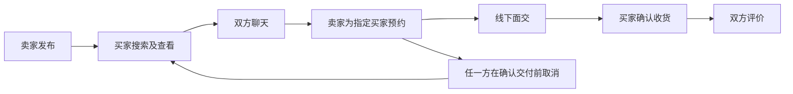
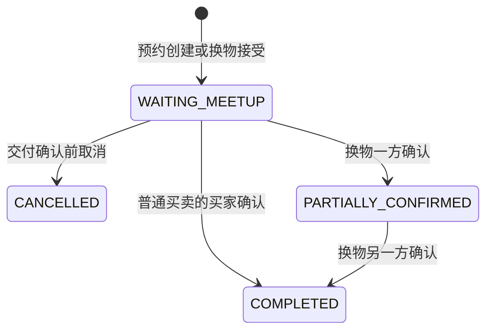

# Campus Neighbour 功能与页面设计

> **2026-09-19 实施更新：** 13类页面已有首版实现，入口与浏览器验证见[实施记录](implementation/README.md)。当前使用首版建议规则，页面还可经团队评审调整。

版本：v0.1 完整初稿｜日期：2026年9月18日｜负责人、审核人：待填写。

状态：供团队评审，尚未实现或验证。下文具体规则为建议基线；涉及需求说明书D01—D13的决定仍待确认。

## 1 先看这份文档怎么用

需求说明书说“要有聊天”，本文说明聊天入口、页面布局、按钮和失败反馈。页面编号沿用[需求说明书](requirements.md)P01—P13，FR代表功能需求。本文是文字线框原型，尚无高保真视觉稿。

范围包含普通买卖、校园筛选与简介、季节专区、一对一换物、管理、通知和支付展示。地图、美食、生活指南、选修课评价和真实支付留在Future Work。快捷问题是人与人消息，不使用AI回答。

## 2 全站导航与公共行为

桌面：顶部显示Logo、商品入口、季节专区、发布、消息、我的交易、个人菜单、语言和主题切换；管理员额外有管理入口。手机：底部为逛一逛、发布、消息、我的；筛选改为抽屉，交易从“我的”进入。

URL筛选可分享；返回列表保留筛选与滚动位置。未登录执行发布、聊天、预约等操作时转登录，成功后回原页面并由用户重新确认操作。按钮禁用必须有原因。无权限显示说明及返回入口，不展示受保护字段。

所有数据页面覆盖：加载骨架、正常数据、空状态、可重试错误、登录过期、无权限、资源不存在。请求提交中禁止重复点击，但服务端仍负责去重。网络结果未知时显示“正在确认结果”，不得直接宣称失败或成功。

主题为light/dark，首次跟随系统、选择后保存。界面语言为zh-CN/en；用户内容保留原文。表单有可见标签、键盘焦点和字段错误提示；状态使用文字配合颜色；弹窗关闭后焦点回到触发按钮。

## 3 核心流程



预约建议采用卖家创建即生效，买家在聊天中已确认安排；若团队要求买家再次确认，必须同步修改状态、接口及测试后实施。支付展示入口不参与该流程的状态变化。

## 4 页面逐项设计

| 页面／需求 | 布局和信息 | 输入与操作 | 成功结果／异常反馈 |
| --- | --- | --- | --- |
| P01 登录注册 FR01 | Logo、邮箱与密码表单、切换注册、返回浏览 | 注册填邮箱、昵称、密码；登录后返回原页；退出在个人菜单 | 字段校验具体显示；登录失败统一提示；未接学校认证时不显示已认证 |
| P02 商品列表 FR03 | 搜索栏、分类／价格／楼栋／课程筛选、商品卡和分页 | 输入关键词，组合筛选，清空条件，按最新／价格排序 | 条件放URL；价格上下限错误不提交；空结果引导减少条件 |
| P03 商品详情 FR02/03/10 | 图片、标题价格成色、楼栋、教材版本／课程、卖家简介、状态 | 联系卖家、发起换物；本人看到编辑／下架；入口只对可用商品开放 | 商品被预约时显示不可预约，可继续原有聊天；违规隐藏商品向无关用户返回不存在 |
| P04 发布编辑 FR02 | 基础信息→图片→校园／课程→换物意愿→预览 | 标题、描述、价格、分类、楼栋、成色、图片；教材补课程版本；可选换物意愿 | 发布成功到详情；校验定位字段；保留本地草稿；已预约时关键信息锁定 |
| P05 我的商品 FR02 | 按可交易、已预约、已售出／交换、下架分类 | 查看、编辑、下架；下架后符合条件可重新上架 | 显示关联交易；不能通过下架释放有效预约；操作后刷新状态 |
| P06 消息 FR04/13—15 | 会话列表、商品摘要、对方昵称、历史、输入区、快捷问题 | 问价格／状态／地点、自由消息、重试、加载历史；卖家可预约指定买家 | 持久化后才成功；断线提示及恢复；第三人不可读写；历史保留原文 |
| P07 我的交易 FR05—07/12 | 买入／卖出／换物切换、状态筛选、交易卡 | 查看详情、进入聊天 | 空列表引导逛商品；不混用商品状态和交易状态 |
| P08 交易详情 FR05—07 | 商品快照、双方身份、状态时间线、面交安排、操作区 | 卖家创建预约；交付前取消；买家确认收货；完成后评价；打开支付展示 | 确认收货二次确认；过期状态冲突时刷新；非参与者拒绝 |
| P09 支付展示 FR09 | 金额展示（如有交易上下文）、说明、返回按钮 | 点击Pay进入，返回原交易；无交易上下文也能展示说明 | 固定显示“暂时无法提供支付方式”；不显示成功、不改变交易、不收集支付资料 |
| P10 个人资料 FR01/10 | 公开简介预览、编辑表单；他人页只读 | 昵称、学院、专业、年级、简介；课程背景含课程、教师和简述 | 未填选填信息显示“未填写”；邮箱学号、具体宿舍房号不公开 |
| P11 季节专区 FR11 | 专区名、起止日期、说明、复用商品卡 | 点击查看、筛选 | 结束后提示已结束；商品售出后不再列为可交易；不复制商品数据 |
| P12 换物 FR12 | 我提供的商品、对方商品、双方快照、请求状态、确认进度 | 选自己的可交易商品、发起／撤回、对方接受／拒绝；接受后分别确认 | 任一商品失效则接受失败；单方确认后显示等待对方；不补差价 |
| P13 管理 FR08/11 | 商品与账号处理、字典、专区、处理记录 | 隐藏／恢复违规商品、限制／恢复账号、编辑字典与专区，填写理由 | 权限服务端校验；处理留痕；不能代收货，不能删除交易历史 |

通知为公共抽屉：新消息、预约、取消、完成事件，未读数、标记已读、打开对象。对象失效时显示不可用；跳转仍验证权限。

## 5 关键页面线框

### 商品详情（手机）

```text
[返回]              [中文/EN] [主题]
[          商品图片轮播          ]
高等数学教材                 ¥25.00
九成新 · 示例楼A · 可交易
课程／版本／说明
卖家昵称 → 公开简介
[联系卖家]              [申请换物]
```

### 聊天

```text
[返回会话]  对方昵称
商品摘要：高等数学教材 · ¥25.00 · 可交易
对方：周五下午可以吗？
我：可以。                       已发送
[问价格] [问物品状态] [问交易地点]
[自由聊天：输入文字          0/20]
[发送]                   [卖家：创建预约]
```

三个按钮先预填问题，用户点击发送后才发给对方。固定模板建议用服务端模板编号发送，允许完整英文模板超过20字符；用户编辑后成为自由消息并受20个用户可见字符限制。emoji组合按一个可见字符计数，具体前后端实现需共同测试。连续发送多条允许；空白禁止。英文自由消息仍限20字符，体验问题作为D04评审项，不自行改变上限。

| 模板编号 | 中文 | English |
| --- | --- | --- |
| ASK_PRICE | 请问价格是多少？ | What is the price? |
| ASK_CONDITION | 请问物品现在是什么状态？ | What condition is the item in? |
| ASK_LOCATION | 请问在哪里交易？ | Where can we meet? |

### 交易详情

```text
交易编号 · 待面交
商品快照 / 约定价格
地点：示例楼A入口   时间：9月30日16:00
时间线：预约创建 → 等待面交 → 收货确认 → 完成
[联系对方] [取消预约] [买家：确认收货]
[Pay（展示页）]
```

## 6 状态与按钮规则

商品业务状态：AVAILABLE、RESERVED、SOLD、EXCHANGED、WITHDRAWN。管理可见性另用VISIBLE/HIDDEN，避免违规隐藏把预约占用抹掉。界面优先显示“已下架”提示，同时参与者仍能查看交易状态。

交易状态：WAITING_MEETUP、PARTIALLY_CONFIRMED（仅换物）、COMPLETED、CANCELLED。没有“支付成功”状态。



换物请求单独记录PENDING/ACCEPTED/REJECTED/WITHDRAWN/INVALIDATED。请求未接受不占用物品；接受原子占用两件物品。请求发出后任一商品关键内容版本变化，接受失败并要求重新发起。单方确认后的分歧保留记录，首版不提供强制释放按钮；异常关闭规则仍由D09决定。

预约商品只能有一个有效交易。取消时如卖家未下架且未被管理隐藏，恢复可交易；否则保留下架状态。取消、完成和评价重复提交应返回原结果，不新增记录。

## 7 评审清单

请结合[待定项](requirements.md#9-待定事项与变更管理)确认：注册方式、资料公开范围、图片限制、20字英文体验、卖家创建预约是否足够、取消规则、评价尺度、账号受限处理、专区条件和换物争议。当前线框不代表视觉样式已定稿。

评审结果、评审人、日期：待填写。高保真原型和实际页面截图：待实现后补充。

## 8 待定事项的候选方案索引

下表方便一次评审；“建议”不代表团队已确认。决定改变时同步相关需求、页面、字段、接口和测试。

| 待定项 | 初稿建议／仍需决定 | 主要影响文档 |
| --- | --- | --- |
| D01 账号 | 普通邮箱注册与会话登录；未验证不显示认证；校园验证、找回方式与会话时长待定 | 架构、接口、运行 |
| D02 公开资料 | 昵称公开，学院专业年级课程背景选填；不公开邮箱学号或房号 | 页面、数据、接口 |
| D03 发布 | 标题描述价格分类楼栋成色及1—6张图片必填；每张≤5MiB；教材课程版本是否必填待定 | 数据、接口、测试 |
| D04 自由消息 | 每条20个可见字符，纯文字可连发；英文体验需评审 | 页面、接口、测试 |
| D05 预约 | 卖家创建生效，交付确认前任一方可取消；改安排先取消重建；不设自动超时 | 页面、数据、接口 |
| D06 评价 | 完成后双方各一次，1—5分、文字≤300，初稿不允许修改，公开展示 | 数据、接口、测试 |
| D07 限制账号 | 禁止新业务写入；允许查看历史、取消未交付交易及确认真实收货；限制与隐藏分开处理 | 数据、接口、测试 |
| D08 校园字典 | 管理员维护模拟字典；专区按时间、分类和楼栋筛选；正式资料来源待定 | 数据、接口 |
| D09 换物 | 一对一无差价；内容版本改变需重新发起；单方确认后保留占用，无自动强制关闭；异常处理方案待定 | 页面、数据、测试 |
| D10 模板 | 三按钮先预填再确认；完整固定英文模板不受自由消息20字限制，修改后受限 | 页面、接口、测试 |
| D11 数据 | 历史记录不级联删除；备份与匿名化保留期限、注销流程待定 | 数据、运行 |
| D12 验收环境 | 核心功能和一致性先验收；浏览器设备、数据规模及性能阈值待实际环境确定 | 测试、运行 |
| D13 技术 | 按用户技术方向先组合验证再锁补丁版本；不假定任何依赖组合已通过 | 架构、协作、运行 |

评审决定、理由、决定人和日期：待填写。
