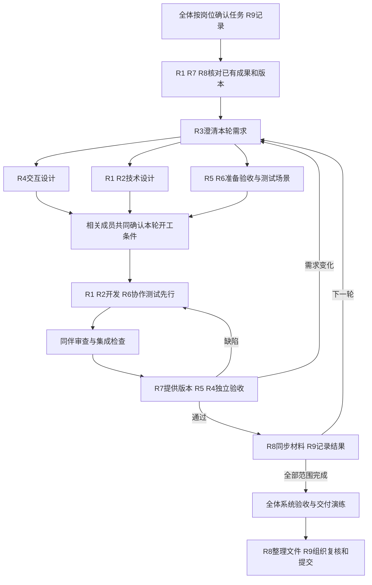

# Campus Neighbour 九人分工与项目协作手册

版本：v0.2 岗位名单已确定｜日期：2026年9月23日

用途：让每位成员知道负责什么、需要学什么、先看什么、什么时候开始、把结果交给谁，以及怎样判断任务完成。

本手册细化[开发协作与任务计划](../CONTRIBUTING.md)，属于八份工程文档中的协作配套材料，不增加新的业务模块。R1—R9岗位姓名已按项目发起人提供的名单填写；具体任务审核人、内部日期和实际进度仍待填写。岗位确定不代表活动已经完成或测试已经通过。

**阅读导航：** 查看自己的岗位先看[九人总览](#2-九个岗位总览)和[首轮任务](#8-首轮两至三天的具体任务)；了解接力顺序看[完整流程](#6-从项目启动到最终提交的完整顺序)和[单功能示例](#7-一个功能怎样从一个人交到下一个人)；实际开工查[岗位详情](#4-每个岗位的详细任务)、[记录模板](#10-任务交接和审核怎么记录)及[最终交付](#13-课程节点与最终交付)。

## 1 先统一分工方式

YUHAN JIAO承担主要开发与技术整合，RUIYU GONG担任开发协作者，其余成员按下表承担需求、交互、测试、运行、文档与课程交付。每个人对具体成果负责，并参与相关决定。

这里的“负责人”负责推动完成、维护结果和接收反馈，可以找其他成员协作。一个人不必独自完成整个岗位的所有工作。工作量应在每轮评审时调整，不能因为岗位名字相同就认定贡献相同。

执行时遵守以下约定：

1. 每项任务只有一名主负责人，至少一名其他成员审核；一人可以参与多个任务。
2. 全体理解发布、搜索、聊天、预约、面交确认、评价这一条交易主线。
3. 需求、设计、测试和文档从第一轮开始，并随功能更新；每次只把即将开发的功能细化到可实施程度。
4. 已有初稿用于评审和修订，已有实现用于核验和接手，不重复制造材料。先确认目标分支与版本，不能根据旧文档直接判断功能未实现。
5. 想参与代码的成员领取边界清楚的小任务，并配对完成；主开发保留核心流程整合职责。
6. 所有测试结果、访谈结论和贡献记录反映真实活动。已有代码后来补的测试应标注为回归测试，不补写虚假的 TDD 先行过程。

## 2 九个岗位总览

| 编号 | 岗位 | 最终负责的结果 | 建议起点 | 姓名 |
| --- | --- | --- | --- | --- |
| R1 | 技术负责人／核心开发 | 核心交易流程可运行，架构和整合可维护 | 熟悉前后端及数据库 | YUHAN JIAO |
| R2 | 开发协作者 | 独立小功能、测试和代码复核 | 有编程基础，或与 R1 配对学习 | RUIYU GONG |
| R3 | 需求负责人 | 业务规则明确、范围有依据、验收有标准 | 能梳理流程、提问和记录结论 | YIAYI WU |
| R4 | 交互与体验负责人 | 电脑和手机页面可理解、可操作 | 愿意学习原型与页面设计 | JIAYI ZHENG |
| R5 | 功能测试负责人 | 用户操作经过独立验证，问题可复现 | 细致，能按步骤执行和比较结果 | HAN HUANG |
| R6 | 自动化与质量负责人 | 关键规则、权限和异常有可重复测试 | 有编程基础，愿意学习测试工具 | ZIYE JIANG |
| R7 | 运行与交付负责人 | 他人可以启动、部署和恢复项目 | 愿意学习环境配置、容器和日志 | RUIJIE LI |
| R8 | 技术文档负责人 | 报告与手册准确、完整、来源清楚 | 能整理材料并理解系统流程 | JUNYU PAN |
| R9 | 项目协调与展示负责人 | 任务有人接、课程材料准时交、展示可复现 | 沟通、跟进和表达能力 | LU LIU |

后文流程图、交接表和工作包中的R1—R9均对应以上姓名。岗位调整需更新此表及相关文档；“建议起点”描述岗位所需准备，不是对具体成员当前能力的评价。

### 如果暂时只有 R1 能稳定开发

- R2 先与 R1 完成一个小功能或一处缺陷修复，再逐步独立；不直接把整个前端或后端交给新手。
- R6 先与 R5 写出测试场景，学习执行接口测试，再与开发者配对写自动化；开发者仍负责自己的测试先行工作。
- R7 先照说明在另一台电脑启动系统，记录缺失步骤，再学习配置与部署。
- 在 R2、R6 尚不能独立审核代码时，不能把形式上的“同意”当作技术审查；先共同走读代码、检查实际测试，关键变化安排具备相应知识的人复核。
- R3、R4、R5、R8、R9 仍可立即产生真实成果，无须等代码学习结束。

## 3 全体先读什么、学到什么程度

### 所有人必读

1. [团队阅读版](team-guide.md)：能用自己的话解释完整交易流程。
2. [功能与页面设计](product-design.md)：能说明自己的操作会影响哪些页面。
3. [协作规范](../CONTRIBUTING.md)：理解领任务、测试先行、审核与完成标准。
4. 本手册：找到自己的岗位及下一位接收成果的人。

全体应理解：FR 是功能编号，NFR 是质量要求，D 是待定问题；Issue 是一项任务或问题记录，PR 是供他人审核的一组修改，commit 是一个可定位的版本记录。无需一开始就掌握全部框架。

至少学会在 GitHub 阅读文档、提交问题、补充证据和查看任务状态。文档可以先通过网页修改并发起 PR，由同伴协助完成首次操作；代码成员还需学习本地分支、提交和处理冲突。

### 阅读状态说明

部分工程文档保留早期“待实现／未验证”标记。启动分工时，R1、R7、R8 应核对仓库中的实际实现分支、测试结果和文档日期，形成一份现状记录。文档状态更新必须有证据，不根据文件存在就写“已完成”，也不因文档较旧就重做已有功能。

## 4 每个岗位的详细任务

### R1 技术负责人和核心开发

**负责人：YUHAN JIAO。**

**先读：** [需求](requirements.md)、[架构](architecture.md)、[数据库](database.md)、[接口](api/README.md)、[测试计划](testing.md)。

**需要掌握：** 当前前后端技术、数据库事务、会话与权限、实时消息、Git、TDD。技术版本以实际验证后的架构记录和锁定依赖为准。

**首次任务：** 盘点已有代码和分支，演示已能运行的流程，列出未实现、存在缺陷和待验证事项；确定 R2 可以接手的小任务。

**每轮任务：**

- 与 R3 确认规则是否可实现，与 R4 确认页面交互，与 R6 确认关键测试。
- 维护架构和数据库约束；与 R2 共同维护接口，明确前后端错误与状态。
- 负责预约、取消、收货、换物等核心状态变化，保证同一商品不会重复占用。
- 对新行为执行 Red → Green → Refactor；修复缺陷前补复现测试。
- 审查 R2 的修改，整合到可验收版本；自己的修改交 R2 或具备相关能力的 R6 复核。
- 把运行信息交 R7，把技术决定和实际限制交 R8。

**交付：** 小范围 PR、对应测试结果、接口与数据变化说明、可运行版本、已知问题。

**完成标准：** 对应需求有验证证据，通过他人审核，R5 能按约定步骤验收；主开发自己演示成功不足以完成任务。

### R2 开发协作者

**负责人：RUIYU GONG。**

**先读：** 所负责功能的需求、页面、接口，以及[协作规范](../CONTRIBUTING.md)。涉及保存数据时再读对应数据库部分。

**需要掌握：** 对应的 React／TypeScript 或 Java 基础、Git 分支、运行相关测试。先选一个技术方向。

**首次任务：** 启动开发环境，与 R1 共同完成一处小修改，走通测试、提交和审核流程。

**每轮任务：**

- 从个人资料、筛选界面、季节专区、管理页面等候选任务中领取一个；先核对现有实现，已完成的部分可改为缺陷修复或体验完善。
- 阅读并确认需求和接口，补测试后实现，不擅自改变交易核心规则。
- 页面任务同时考虑手机／电脑、中英与深浅主题。
- 整理复现步骤和测试结果，交 R1 审查，交 R5 验收。
- 对熟悉范围内的 R1 修改进行审查，记录自己发现的问题和判断依据。

**交付：** 能独立审查的小 PR、测试、必要的文档修改。

**完成标准：** 功能能接入公共流程，测试通过，相关成员验收；只有静态页面或未连接接口的演示不算完整功能交付。

### R3 需求负责人

**负责人：YIAYI WU。**

**先读：** [申报书](proposal.md)、[需求说明书](requirements.md)，重点看 D01—D13 待定事项。

**需要掌握：** 用户故事、功能与质量要求、前置条件、正常及异常流程、验收条件。可以先用日常语言表达，再整理为一致格式。

**首次任务：** 选取一个典型场景，访谈可联系的学生买家和卖家，或组织原型走查；记录实际反馈，并把未确认内容明确标出。

**每轮任务：**

- 将“支持预约”等模糊描述展开为谁能做、何时能做、成功和失败后怎样变化。
- 组织相关人员讨论待定规则，例如取消、评价、英文消息长度和换物确认；记录选择及理由。
- 与 R4 确认页面表达，与 R5 确认规则可验证，与 R1 确认可实施。
- 更新需求编号、验收条件及其关联设计、测试；需求变更先评估影响。
- 区分计划范围、实现状态和未来工作，不因实现便利自行删去换物等已约定功能。

**交付：** 访谈或走查摘要、需求修改、决策记录、验收场景。

**交给：** R4 做交互细化，R1／R2 做技术设计，R5／R6 准备测试。

**完成标准：** 下游能据此设计和验证，关键歧义已解决或明确阻塞；仅重新排版已有需求不算完成需求分析。

### R4 交互与体验负责人

**负责人：JIAYI ZHENG。**

**先读：** [页面设计](product-design.md)、对应需求及质量要求。

**需要掌握：** 一种原型表达方式、页面跳转、表单校验、加载／空白／错误状态、响应式布局基本概念。可用原型工具或清晰线框，不要求先会 React。

**首次任务：** 画出商品详情到联系卖家的电脑和手机流程，标注按钮、信息和异常提示。

**每轮任务：**

- 根据 R3 的规则细化页面，明确哪些信息公开、哪些只给交易双方看。
- 为关键页面补电脑和手机布局；同时考虑长英文、深浅主题、键盘操作和触控。
- 标注加载、无结果、未登录、无权限、发送失败、重复操作等状态。
- 与 R1／R2 确认可实现性，与 R5 约定视觉及操作检查点。
- 在实际页面出来后复核，记录原型与实现的合理变化，同步中英文文案。

**交付：** 可访问的原型或线框、页面说明、文案表、体验问题与修改建议。

**交给：** R1／R2 实现，R5 验证，R8 更新手册与图示。

**完成标准：** 开发者不需猜按钮行为；正常与失败场景均有说明；实际页面经过走查。

### R5 功能测试负责人

**负责人：HAN HUANG。**

**先读：** [测试计划](testing.md)、负责功能的需求和页面说明。

**需要掌握：** 前置条件、操作步骤、预期与实际结果、边界值、复现、回归。初期不要求编程。

**首次任务：** 给一个交易场景编写测试用例，用虚构账号准备所需数据；有可用版本后实际执行。

**每轮任务：**

- 在开发前与 R3 写出正常、异常及权限场景，交 R6／开发者转成适合自动化的测试。
- 在指定版本上执行两个账号的买卖、聊天、预约、评价和换物流程。
- 与 R4 检查手机／电脑、中英和深浅主题；按风险选择组合，关键流程覆盖两种屏幕。
- 提交包含版本、环境、步骤和证据的问题，区分功能缺陷、需求歧义与体验建议。
- 修复后复测，并检查相关流程是否受影响；组织学生试用，记录真实困难。

**交付：** 用例、执行记录、缺陷 Issue、复测结果、试用反馈。

**交给：** 缺陷交 R1／R2，规则疑问交 R3，体验问题交 R4；验收证据交 R8／R9。

**完成标准：** 结果可重复、有版本信息；不能只写“测试正常”，也不以发现的问题数量衡量工作。

### R6 自动化与质量负责人

**负责人：ZIYE JIANG。**

**先读：** [测试计划](testing.md)、[协作规范](../CONTRIBUTING.md)、相关接口与数据库规则。

**需要掌握：** 先选择 JUnit、前端行为测试或接口／浏览器自动化中的一个方向，再扩展；理解权限、数据隔离和测试结果。

**首次任务：** 跑通现有测试，与开发者共同完成一个失败测试到修复通过的示例；记录失败究竟来自业务还是环境。

**每轮任务：**

- 与开发者分配测试范围：开发者负责其实现所需的单元／组件测试，R6 重点补跨模块、权限、集成及关键端到端测试。
- 检查同一商品竞争预留、非参与者读取聊天、重复确认、换物部分确认等风险。
- 数据库并发行为使用真实数据库验证，避免只用替身测试得出结论。
- 帮助维护持续集成，处理不稳定测试，检查失败日志；不靠跳过测试获得绿灯。
- 将人工发现的关键缺陷转为回归测试，与 R5 确认覆盖关系。

**交付：** 自动化测试、运行结果、需求覆盖索引、Red／Green 或回归记录。

**交给：** R1／R2 修复，R7 作为发布前检查依据，R8 汇总质量证据。

**完成标准：** 测试能因目标行为错误而失败，并在修复后通过；执行条件可复现。CI 通过不单独证明过程符合 TDD。

### R7 运行与交付负责人

**负责人：RUIJIE LI。**

**先读：** [运行与用户说明](operations.md)、架构中的环境与部署部分。

**需要掌握：** 运行命令、环境变量、容器与持久化、日志查看、基本备份恢复；从能够在第二台电脑启动开始学习。

**首次任务：** 确认目标提交，按现有说明安装和启动；缺少代码或配置时记录阻塞，不猜测命令或声称已启动。

**每轮任务：**

- 维护实际依赖版本、配置示例、启动与测试命令；在另一环境复现。
- 与 R1／R2 准备数据库迁移和虚构演示数据，确保不依赖个人电脑的隐藏配置。
- 维护演示环境，按 R5 的要求准备账号和数据；重置数据前通知使用者。
- 验证重启后数据与图片仍存在；在隔离环境演练备份恢复。
- 发布前确认提交、测试、备份与迁移影响；失败时停止发布并记录恢复步骤。

**交付：** 可复现运行说明、配置模板、演示数据方案、发布和恢复记录。

**交给：** R5 测试，R8 整理用户手册，R9 准备展示；部署问题交 R1／R2。

**完成标准：** 除开发者外的成员能按说明启动和操作；实际密钥、真实聊天和个人数据不放公开仓库。

### R8 技术文档负责人

**负责人：JUNYU PAN。**

**先读：** 八份工程文档的目录、课程报告要求、[课件对应说明](proposal-course-alignment.md)。

**需要掌握：** 技术写作、引用、图表和版本管理；能解释系统各部分作用，并向内容负责人核对事实。

**首次任务：** 建立技术报告提纲和材料索引，标明每章内容来源、提供人及缺口。

**每轮任务：**

- 收集 R3 的需求依据、R4 的设计、R1／R2 的技术决定、R5／R6 的测试、R7 的运行证据。
- 检查文档与实际功能一致，提醒相应负责人修改过期内容；业务与技术正确性由对应负责人复核。
- 维护用户手册，用实际页面截图和可操作步骤表达；交给未参与编写的人试用。
- 汇总报告章节，统一术语、编号和引用；保留限制、失败尝试及其影响，不把计划改写为成果。
- 按课程要求检查格式、页数、引用和最终文件，并将定稿交 R9。

**交付：** 技术报告、用户手册、材料索引及文档一致性检查记录。

**完成标准：** 各章节经过内容负责人审核，结论有真实证据，手册经他人实际走通。R8 不独自代写所有成员的过程与贡献。

### R9 项目协调与展示负责人

**负责人：LU LIU。**

**先读：** [申报书](proposal.md)、[协作规范](../CONTRIBUTING.md)、课程交付要求和本手册。

**需要掌握：** 任务拆分、依赖关系、会议记录、状态跟进、展示脚本和文件提交检查。

**首次任务：** 按已确定岗位组织首轮任务确认；优先核对9月25日申报书中的待填信息、组员姓名和学号。

**每轮任务：**

- 维护任务负责人、审核人、内部截止时间、下一位接收人和阻塞原因。
- 组织每周短评审，让各岗位展示实际结果；记录决定和下一步。
- 协调跨岗位阻塞、任务转交和工作量调整；不代替相关负责人作业务或技术判断。
- 根据证据准备 Project Updates，维护贡献记录，组织全体定期确认。
- 整理展示脚本和幻灯片，安排每人讲解实际参与的部分，组织演练和备用演示方案。
- 汇总最终交付清单，组织复核，由小组确认的一名提交人上传并保存回执。

**交付：** 任务看板、决定记录、进度更新、贡献记录、展示材料和提交回执。

**完成标准：** 每个待办有人接、阻塞有下一步、汇报有依据；提交成功由回执确认，不能只依据“已经准备好”。

## 5 八份工程文档由谁维护

维护人负责组织更新，内容提供人负责相关事实，审核人负责检查。R8 统一表达和引用，不代替其他成员理解自己的内容。

| 文档 | 主维护岗位 | 主要提供内容 | 审核与使用岗位 |
| --- | --- | --- | --- |
| 需求说明书 | R3 | 用户反馈、规则、验收条件 | R1、R4、R5 |
| 功能与页面设计 | R4 | 流程、双端布局、状态与文案 | R3、R2、R5 |
| 技术选型与系统架构 | R1 | 技术决定、模块边界、验证结果 | R2、R6、R7 |
| 数据库设计 | R1 | 数据关系、约束、迁移 | R2、R6、R7 |
| 接口契约 | R2，由 R1 技术把关 | 请求响应、权限、错误与事件 | R1、R4、R6 |
| 开发协作与任务计划 | R9 | 任务、依赖、流程与决定 | 全体；技术流程由 R1／R6 复核 |
| 测试计划与验收记录 | R5 | R5 人工测试；R6 自动化与覆盖 | R3、R1、R7 |
| 部署运行与用户说明 | R7 | R7 运行；R8 用户步骤；R4 页面说明 | R5 独立复现，R1 检查技术内容 |

申报书由 R9 组织、R3 更新范围、R8 整理格式、R1 核对可行性，全体核对成员信息。技术报告由 R8 汇总，各岗位提供并审核各自材料。展示由 R9 组织，全体参与讲解和演练。

## 6 从项目启动到最终提交的完整顺序

### 6.1 总体流程



图中的循环针对一个小功能。设计、测试、运行和材料准备可以并行；下一轮需求也可在本轮开发期间准备。R5 的测试场景在开发前准备，实际测试在每次有可用版本后进行。

### 6.2 阶段交接表

| 阶段 | 谁先开始、拿什么输入 | 做什么、交给谁 | 转入下一阶段的条件 |
| --- | --- | --- | --- |
| S0 启动与现状核对 | R9组织全体；R1／R7／R8查看已有文档、分支和证据 | 按岗位记录首轮任务、基线版本、已完成及待验证项；交全体 | 每人有首项任务，明确以哪个版本为准；未确认状态保留待验证 |
| S1 范围和需求 | R3根据申报书、现有需求和反馈开始 | 明确本轮功能、角色、规则、异常及验收条件；交R4、R1／R2、R5／R6 | 相关D项有决定，范围冲突有结论，验收可描述 |
| S2 设计与测试准备 | R4、R1／R2、R5／R6并行，R7准备环境，R8准备材料结构 | 页面、数据、接口、场景相互核对；R9记录依赖 | 本轮所需设计与测试场景一致，环境可用；不要求所有远期细节都写完 |
| S3 小步开发 | R1／R2领取确认后的行为，R6协作 | 写失败测试、实现、重构，提交PR；交同伴审核 | 有实际测试结果和变化说明，相关资料同步 |
| S4 审查与整合 | 同伴检查PR，R6检查相关自动化，R1组织整合 | 修正审查问题，合并后核对集成结果；R7提供可定位的测试版本 | 自动检查通过，已知问题明确，R5可访问或启动该版本 |
| S5 功能验收 | R5执行，R4看体验，R3处理规则疑问 | 问题交R1／R2修复，修复后复测；通过证据交R8／R9 | 对应验收条件满足，无未解决的阻断问题；文档与实现一致 |
| S6 迭代评审 | R9组织，各岗位展示结果 | R3更新优先级，R1／R2安排下一轮，R8整理报告素材 | 明确下一轮任务、负责人、依赖和内部日期；未完成任务有解释 |
| S7 整体交付验收 | 计划范围全部集成后，R5／R6／R7主导 | 完整买卖与换物、权限、双端、双语主题、启动与恢复检查；问题返回S3或S1 | 关键流程通过，高影响缺陷解决；局限如实记录并经小组讨论 |
| S8 材料与展示定稿 | R8汇总报告及手册，R9组织演练，R7准备交付软件 | 内容负责人审核章节，未编写者试用手册，全体核对贡献；交提交人 | 软件、报告、手册、展示材料版本一致；课程格式和清单核对完成 |
| S9 提交与归档 | R9组织，实际提交人待填写，备份提交人待填写 | 一名成员代表小组上传；另一人复核回执及文件；全体获得最终版本 | 保存上传成功回执、文件清单和版本；未上传前状态仍为待提交 |

所有内部日期由小组填写。S7—S9 要预留修复、演练和上传检查时间，不把首次整体运行留到最后一天。

### 6.3 现在可以立即并行做什么

- R3核对规则、R4走查页面、R5写用例、R8建报告提纲、R9检查课程交付，可以同时开始。
- R1／R2核对代码和技术缺口，R6检查测试，R7验证运行环境，可以同时开始。
- 有清晰规则的小功能可以先进入实现；有争议的功能留在需求阶段。
- 未参与实现的成员可独立检查已有功能，提供新发现和回归证据。

## 7 一个功能怎样从一个人交到下一个人

以“卖家给指定买家预留商品”为例：

1. **R3发出需求任务。** 写明卖家可预留给指定买家、同一物品最多一个有效占用、取消和确认条件；不清楚的规则先讨论。关联 FR05、FR06 和对应 D 项。
2. **R4补交互，R1／R2补技术约定。** 标明预留按钮、选择买家、成功状态和冲突提示；技术侧约定接口、权限、数据一致性和错误响应。
3. **R5列验收场景，R6和开发者挑选自动化层次。** 包括正常预留、重复请求、越权、两人竞争、取消后再次预留及确认后状态。
4. **R1或R2先写一条行为测试。** 例如两个请求竞争同一商品；确认测试因业务行为不满足而失败，再实现必要处理，再整理代码并重跑。每完成一个行为再推进下一项。
5. **另一名有相关能力的成员审查。** 检查权限、状态、测试和文档；解决问题后按协作规则合并。合并后的实际版本也要通过相关检查。
6. **R7交付可访问的测试版本。** 提供提交编号、启动方式、虚构账号与已知问题。
7. **R5执行，R4检查体验。** 使用买家、卖家和第三人账号，分别验证允许和禁止的动作，记录电脑和手机结果。
8. **问题按性质退回。** 实现缺陷回R1／R2并补复现测试；规则歧义回R3；页面提示回R4；环境故障回R7。不能把所有问题都作为一句“有bug”发给主开发。
9. **R8和R9收尾。** R8更新用户步骤与报告素材；R9记录验收证据、实际贡献和后续问题，满足完成定义后关闭任务。

交接不要求前一个人停止参与。需求负责人要回答实现中的问题，开发者要协助定位缺陷，测试人员要复测，文档负责人要追踪最终变化。

## 8 首轮两至三天的具体任务

本轮目的：确认岗位是否合适并产生第一批可审阅成果。以下是任务建议，没有预先填写完成状态；内部截止时间由 R9 与负责人确认。

| 岗位 | 首轮任务 | 交给谁 | 怎样判断完成 |
| --- | --- | --- | --- |
| R1 | 核对实现分支，演示核心链路，列出缺口和技术阻塞 | 全体，重点R2／R6／R7 | 有目标版本、实际运行或失败记录，下一项技术任务明确 |
| R2 | 配对完成一个小功能或缺陷修复 | R1审查，R5验收 | 有小PR、测试和实际行为变化；不是无目的改格式 |
| R3 | 澄清预约／取消规则，记录一次真实访谈或原型走查 | R4、R1、R5 | 记录来源与结论，待定项有明确下一步 |
| R4 | 商品详情到聊天的电脑／手机原型或现有页面评审 | R3、R2、R5 | 包含正常、未登录、失败状态及中英文文案 |
| R5 | 写发布→搜索→联系卖家的用例；有版本即执行 | R3、R6、开发者 | 有预期结果，执行后有版本、实际结果和复现证据 |
| R6 | 跑通相关测试，配对完成一条权限或边界回归测试 | R1／R2、R5 | 测试失败原因与通过结果可解释，可重复运行 |
| R7 | 在第二环境按说明启动目标版本，记录缺失配置与命令 | R1、R8、R5 | 成功有记录；失败有具体日志、原因与接收人 |
| R8 | 建立技术报告提纲和材料清单，走查一段用户手册 | 各内容负责人、R9 | 每章有材料来源，说明与实际界面的差异被记录 |
| R9 | 按已确定岗位创建首轮任务记录，核对申报书待填项 | 全体 | 每项有负责人和审核人；提交信息由成员确认 |

申报书截止为2026年9月25日23:59 CST。R9应优先协调申报信息核对与提交准备，其他技术任务可以并行；不要求等首轮全部开发任务完成才提交申报书。

## 9 功能工作包怎样分配

沿用协作规范中的 W00—W09 编号。表中“开发”表示责任分配建议；已有功能先核验，再决定是完善、修复还是直接进入独立验收。

| 工作包 | 内容 | 开发与整合 | 需求／设计 | 验证重点及岗位 |
| --- | --- | --- | --- | --- |
| W00 | 需求、设计和待定规则评审 | R1评估技术影响 | R3主导，R4参与，R9记录 | R5／R6检查可测试性 |
| W01 | 技术环境、测试环境与CI | R1／R2，R7运行配置 | R1维护架构 | R6自动检查，R7独立复现 |
| W02 | 账号与资料 | R1账号权限，R2资料等小功能 | R3／R4 | R5用户操作，R6权限与私密字段 |
| W03 | 商品、图片、列表和筛选 | R1／R2按页面或接口拆分 | R3／R4 | R5数据与筛选，R6上传边界和归属 |
| W04 | 真人私聊和快捷消息 | R1消息主线，R2界面小任务 | R3确认消息规则，R4设计 | R5双账号，R6越权、长度、断线恢复 |
| W05 | 预约、取消、收货和评价 | R1状态主线，R2界面或局部实现 | R3／R4 | R5完整流程，R6并发、重复请求和权限 |
| W06 | 校园简介、字典和季节专区 | R2主做适合任务，R1复核 | R3／R4 | R5课程／楼栋，R6时间和可见性边界 |
| W07 | 一对一换物 | R1交易规则，R2协作页面 | R3明确双方确认，R4画状态 | R5双向流程，R6双商品占用与部分确认 |
| W08 | 管理、通知、支付展示 | R1权限与通知，R2适合的小功能 | R3／R4 | R5操作，R6管理权限及支付页无业务副作用 |
| W09 | 整体验收、运行和课程交付 | R1／R2修复，R7运行 | R8材料，R9展示与组织 | R5／R6整体验证，全体复核 |

R7、R8、R9贯穿各工作包。电脑／手机、中英、深浅主题贯穿页面实现和验收。一对一换物属于计划交付范围；地图、美食、真实支付与担保等保持 Future Work。聊天快捷问题由真实交易对方回复，不扩展为 AI 问答。

## 10 任务、交接和审核怎么记录

### 10.1 任务状态

建议使用：待澄清 → 可开始 → 进行中 → 待审核 → 待验收 → 已完成。

“阻塞”作为附加标记，写清原因、需要谁提供什么、下一次跟进时间。文档或原型任务没有代码测试阶段，也要由接收人检查是否可使用，才能进入已完成。

任务尽量拆到两三天内可交付一个清楚结果。超出时按行为、页面或证据拆分，不按“先写一半代码”拆成无法验证的部分。

### 10.2 一项任务的最小模板

```text
任务标题：
关联需求／工作包：
目的及范围：
负责人：待填写
审核人：待填写
下一位接收人：待填写
内部截止时间：待填写
输入材料与目标版本：
具体步骤：
交付物及存放位置：
验收条件：
依赖与阻塞：
实际结果与证据：未执行／待填写
```

### 10.3 交接消息模板

```text
我完成了：
请谁接手、接下来做什么：
文档／原型／PR／测试版本链接：
怎样查看或复现：
已验证的范围及证据：
尚未解决的问题：
希望何时反馈：待填写
```

接收人回复“已接收，可以继续”或“缺少哪些材料，需补充什么”。接收不等于审核通过。负责人根据反馈补齐资料，不能只发一句“做好了”就关闭任务。

### 10.4 缺陷记录模板

```text
标题：在哪一步出现什么问题
关联需求／测试：
版本与环境：
前置条件与虚构账号角色：
复现步骤：
预期结果：
实际结果：
截图／日志等证据（去除敏感信息）：
影响范围：
接收人：待填写
修复版本：待填写
复测人、日期与结果：待填写／未执行
```

### 10.5 一项功能的完成定义

- 对应需求和待定规则已经确认。
- 实现及相关自动测试通过，TDD或回归过程如实记录。
- 代码由他人审核，集成版本已核对。
- R5完成约定场景，R4完成必要的双端、语言和主题检查。
- 高影响缺陷已解决；其余问题有明确记录、影响说明及后续安排。
- 接口、数据和用户说明中受影响部分已同步。
- 有可定位版本与证据，接收人确认可使用。

### 10.6 文档与设计任务的完成定义

- 解决了清楚的问题，内容有来源，待定与已定分开。
- 与现有需求和实现一致，链接可访问。
- 相关业务／技术负责人审核，下游成员能据此继续工作。
- 记录真实修改与决定，不以字数、页数或排版变化代替成果。

## 11 每周怎样推进、工作量怎样调整

R9每周组织一次短评审，具体时间待填写。建议依次进行：

1. 各负责人展示本轮实际交付物和验证证据。
2. R5／R6汇总缺陷和质量风险，R7说明运行问题。
3. R3／R4说明需求与体验反馈，R1／R2说明影响和工作量。
4. 全体确定下一轮优先任务，R9填写接收人、审核人和内部日期。
5. R8记录需要进入报告的决定和成果，更新材料缺口。

紧急阻塞不用等周会。负责人发现依赖无法满足时及时说明“需要谁在什么时间前提供什么”；R9协调，业务判断由R3牵头、技术判断由R1牵头，相关成员共同讨论。重大范围变化按课程要求与导师讨论。

岗位分工每轮可以调整：有人空闲时接明确的小任务，有人积压时转交资料与状态。新手可逐步从执行用例进入自动化，从原型进入页面实现；不要在交付前突然更换核心责任却没有交接。

## 12 贡献怎样体现

每人维护真实的贡献记录，小组定期共同核对。课程 Group Workload Profile 要求公开、公平地商定成员的定量与定性贡献；具体最终表格使用 MyAberdeen 提供的模板。本手册不预设平均分配比例。

| 成员 | 任务与日期 | 本人完成的内容 | 成果链接／版本 | 审核或使用人 | 对项目的作用 | 后续事项 |
| --- | --- | --- | --- | --- | --- | --- |
| 待填写 | 待填写 | 待填写 | 待填写 | 待填写 | 待填写 | 待填写 |

可以记录的实质贡献包括：发现并解决需求歧义、设计有效流程、完成可运行功能、发现和复测缺陷、建立可重复测试、复现部署、验证手册、整理可靠报告、协调解决依赖、组织有效展示。

衡量时结合工作质量、难度、投入及结果，不只看代码行数、提交次数或文档页数。共同完成的任务分别写明各自部分。允许使用工具辅助，但成员需要理解、核对并能解释自己的成果，按课程要求如实说明相关使用。

## 13 课程节点与最终交付

### 13.1 官方日期与内部安排

以下课程截止时间均为2026年23:59 CST。功能安排来自现有协作计划，是内部建议，需根据核实后的现状调整；不是新增课程要求。

| 课程节点 | 截止日期 | 内部建议达到的状态 | 组织人与材料来源 |
| --- | --- | --- | --- |
| 申报书 | 9月25日 | 确认范围、方法及待填信息，核对最终PDF | R9组织；R3／R8整理；R1核对可行性；全体核对信息 |
| Project Update 1 | 10月12日 | 需求原型、环境与基础流程有可展示证据 | R9汇总；各岗位提供真实结果 |
| Project Update 2 | 11月2日 | 普通买卖流程及相关测试 | R1／R2实现；R5／R6验证；R8／R9汇总 |
| Project Update 3 | 11月23日 | 校园特色、换物和聊天体验迭代 | 对应岗位提交结果及未解决问题 |
| Project Update 4 | 12月7日 | 候选交付版本、系统验收与材料初稿 | R5／R6／R7验证；R8／R9准备交付 |
| 技术报告、软件、展示 | 12月14日 | 全部交付复核、上传并保存回执 | R9组织；提交人与备份提交人待填写 |

申报书必须提交；四次更新至少提交三次。计划按四次准备，确需调整时由小组明确决定并核对课程要求。技术报告、软件、展示分别占小组项目成绩的50%、30%、20%。

### 13.2 最终交付由谁接力

| 交付内容 | 首先提供材料 | 汇总负责人 | 独立复核 | 最后交给谁 |
| --- | --- | --- | --- | --- |
| 技术报告 | 各岗位提供真实过程、决定和结果 | R8 | 各内容负责人核实，另一成员检查格式与引用 | R9组织提交检查 |
| 可运行软件及源代码 | R1／R2提供指定版本，R6提供测试结果 | R7 | R5在交付环境走完整流程 | R9组织提交检查 |
| 用户手册 | R7提供运行步骤，R4提供界面说明 | R8 | R5或其他未编写者独立操作 | 随课程规定的软件交付材料准备 |
| 展示材料与演示 | 全体提供参与部分，R7准备环境 | R9 | 全体演练，R5检查演示场景 | 课程展示提交入口 |
| Group Workload Profile | 每人提供贡献记录 | R9按课程模板汇总 | 全体公开核对并按课程要求确认 | R8纳入报告附录 |
| 上传与归档 | 以上复核通过的最终文件 | 指定提交人，待填写 | 另一成员核对文件、版本与提交回执 | 全体保存最终链接与记录 |

R9负责组织，不意味着自动成为实际上传者。根据课程规定，一名成员代表小组提交；人选与备份人选提前确认。报告页数、文件格式、软件打包及展示要求，以所提供课程要求文件和MyAberdeen提交说明核对；不自行增加或减少交付项。

### 13.3 提交前最后一次检查

- 文件中的组号、专业、姓名、学号及仍需填写的信息已经核对。
- 报告描述与交付软件版本一致，未完成内容明确说明。
- 新环境可按手册运行，演示数据可用，源码和必要配置模板齐备。
- 关键买卖、换物、聊天、权限和支付展示场景有实际验证结果。
- 电脑和手机界面、中英文、深浅主题经过约定检查。
- 测试、访谈、贡献和引用没有虚构记录。
- 展示已演练，演示环境与备选录屏等材料按课程要求准备。
- 提交人与复核人确认上传成功并保存回执，最终文件和版本已归档。

## 14 这套分工如何开始执行

先由 LU LIU（R9）组织大家核对第2节的岗位名单；再按第8节领取一项小任务，填写具体任务负责人、审核人和内部日期。首轮结束后根据成果、兴趣和工作量讨论必要调整，并同步记录。

此后每个功能按第7节交接，每周按第11节评审，最终按第13节交付。主开发负责技术主线，各岗位通过真实成果共同决定项目能否完成和交付。
